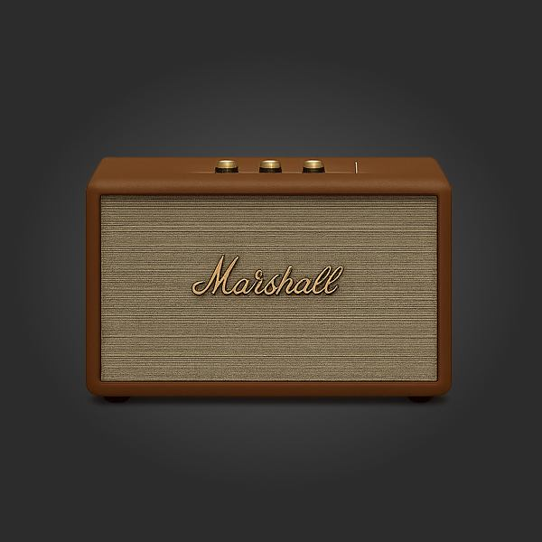

# Marshall Code Review

이 문서는 Marshall 포트폴리오 프로젝트에서 강조할 수 있는 구현 근거를 코드 기준으로 정리한 문서입니다.

## 1. IntersectionObserver Scroll Animation

### Problem

스크롤 애니메이션 대상 요소가 많아질수록 스크롤 이벤트 기반 구현은 반복 계산과 콜백 비용이 커질 수 있습니다.

### Implementation

`IntersectionObserver`를 사용해 요소가 화면에 진입하는 시점에만 애니메이션 클래스를 추가합니다.

```js
const observerOptions = {
  threshold: config.threshold,
  rootMargin: config.rootMargin
};
```

```js
entry.target.classList.add(config.animationClass);
```

관련 파일:

- `js/scroll-animations.js`
- `css/animations.css`

### Result

화면에 들어온 요소에만 애니메이션을 적용해 스크롤 경험을 안정적으로 구성했습니다.

## 2. once + unobserve

### Problem

브랜드 소개형 페이지에서는 대부분의 등장 애니메이션이 한 번만 실행되면 충분합니다. 실행 후에도 계속 관찰하면 불필요한 콜백이 반복될 수 있습니다.

### Implementation

`once: true` 설정에서 애니메이션을 실행한 뒤 `unobserve()`로 관찰을 해제합니다.

```js
if (config.once) {
  observer.unobserve(entry.target);
}
```

관련 파일:

- `js/scroll-animations.js`

### Result

불필요한 반복 관찰을 줄이고, 스크롤 애니메이션의 실행 범위를 명확히 제한했습니다.

## 3. Mobile Menu Stability

### Problem

모바일 메뉴가 열린 상태에서 배경 콘텐츠가 함께 스크롤되면 화면 흐름이 흔들리고, 메뉴 조작 중 현재 위치를 잃기 쉽습니다.

### Implementation

메뉴가 열리면 body scroll lock을 적용하고, 메뉴가 닫히면 overflow 값을 복원합니다. 닫힘 상태 정리는 `transitionend`와 timeout fallback을 함께 사용합니다.

```js
document.body.style.overflow = 'hidden';
```

```js
document.body.style.overflow = '';
```

관련 파일:

- `js/navigation.js`
- `css/marshall.css`

### Result

모바일 메뉴 사용 중 배경 스크롤을 막고, 전환 이벤트가 누락되는 상황에서도 닫힘 상태가 안정적으로 정리되도록 했습니다.

## 4. Focus Trap

### Problem

모바일 메뉴가 열린 상태에서 Tab 포커스가 메뉴 밖으로 이동하면 키보드 사용자가 현재 맥락을 잃을 수 있습니다.

### Implementation

메뉴 내부의 포커스 가능한 요소를 수집하고, 첫 요소와 마지막 요소 사이에서 포커스가 순환되도록 처리했습니다.

```js
const first = focusables[0];
const last = focusables[focusables.length - 1];
```

```js
if (event.shiftKey && document.activeElement === first) {
  event.preventDefault();
  last.focus();
}
```

관련 파일:

- `js/navigation.js`

### Result

키보드 사용자가 모바일 메뉴 내부에서 예측 가능한 순서로 탐색할 수 있습니다.

## 5. ARIA State Sync

### Problem

시각적으로 메뉴가 열려 있어도 접근성 상태가 갱신되지 않으면 보조 기술 사용자가 현재 UI 상태를 파악하기 어렵습니다.

### Implementation

메뉴 열림 상태는 `aria-expanded`, 실제 노출 상태는 `aria-hidden`과 동기화했습니다.

```js
menuBtn.setAttribute('aria-expanded', String(isMenuOpen && isMobile()));
nav.setAttribute('aria-hidden', String(!navVisible));
```

관련 파일:

- `js/navigation.js`

### Result

화면 상태와 접근성 상태를 일치시켜 스크린리더 환경에서도 메뉴 상태를 파악하기 쉽게 했습니다.

## 6. Footer Accordion Accessibility

### Problem

모바일 푸터 아코디언에서 닫힌 목록의 링크가 키보드 포커스 순서에 남아 있으면 보이지 않는 요소로 포커스가 이동할 수 있습니다.

### Implementation

아코디언 열림 상태에 따라 `aria-expanded`, `aria-hidden`, 하위 링크의 `tabindex`를 함께 갱신합니다.

```js
toggle.setAttribute('aria-expanded', String(isActive));
list.setAttribute('aria-hidden', String(!isActive));
```

관련 파일:

- `js/footer.js`

### Result

모바일에서는 닫힌 푸터 목록이 키보드 탐색에서 제외되고, 데스크톱에서는 전체 목록이 자연스럽게 펼쳐진 상태로 동작합니다.

## 7. Content Links and CTA Labels

### Problem

임시 `#` 링크와 반복되는 `더 알아보기` 문구만으로는 사용자가 이동할 목적지를 명확히 파악하기 어렵습니다.

### Implementation

주요 CTA와 푸터/소셜 링크를 실제 Marshall 공식 페이지로 연결하고, 반복 CTA에는 목적지를 설명하는 `aria-label`을 추가했습니다.

```html
<a href="https://www.marshall.com/us/en/headphones"
   aria-label="Marshall 헤드폰 제품 더 알아보기">
  더 알아보기
</a>
```

관련 파일:

- `index.html`

### Result

시각적으로는 간결한 CTA 문구를 유지하면서도 키보드/스크린리더 사용자에게 링크 목적을 더 분명하게 제공합니다.

## 8. Content Image Accessibility

### Problem

의미 있는 제품/아티스트/소셜 이미지가 CSS background로만 제공되면 대체 텍스트를 제공하기 어렵고, 브라우저의 lazy loading과 responsive image 최적화를 활용하기 어렵습니다.

### Implementation

콘텐츠 이미지를 `picture`/`img` 구조로 전환하고, 이미지 역할에 맞는 `alt`, 고정 크기 속성, `loading`, `srcset`, `sizes`를 적용했습니다. JPG fallback은 유지하면서 WebP와 AVIF를 먼저 제공하도록 구성했습니다.

```html
<picture>
  <source type="image/avif" srcset="img/optimized/marshall_speaker-600.avif 600w">
  <source type="image/webp" srcset="img/optimized/marshall_speaker-600.webp 600w">
  
</picture>
```

관련 파일:

- `index.html`
- `img/optimized/`
- `css/marshall.css`

### Result

핵심 이미지가 접근성 트리에 포함되고, 화면 폭과 브라우저 지원 포맷에 맞는 이미지를 선택해 초기 렌더링 부담을 줄였습니다.

## Portfolio Summary

이 프로젝트는 `IntersectionObserver`, Focus Trap, ARIA 상태 동기화, 의미 있는 CTA, WebP/AVIF responsive image 적용을 통해 스크롤 기반 브랜드 경험과 모바일 접근성/성능을 함께 고려한 원페이지 리디자인 프로젝트입니다.
