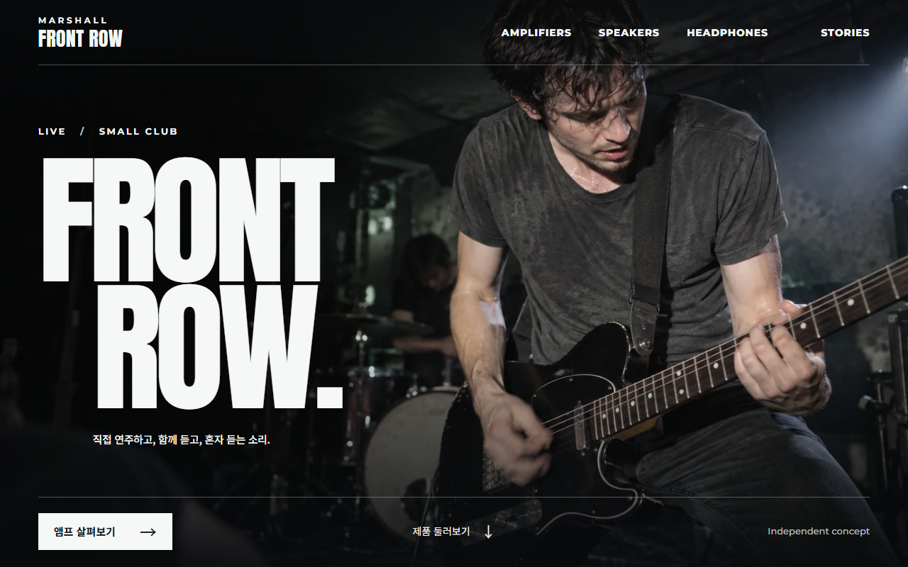
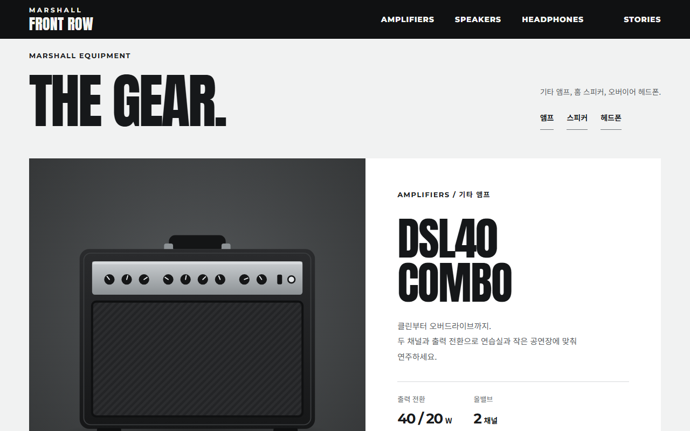
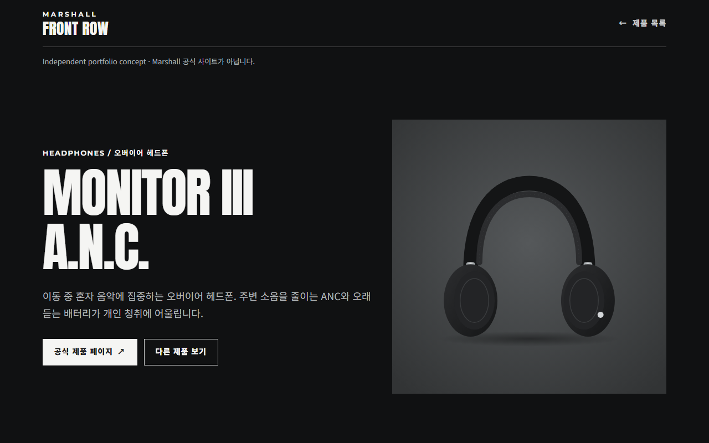
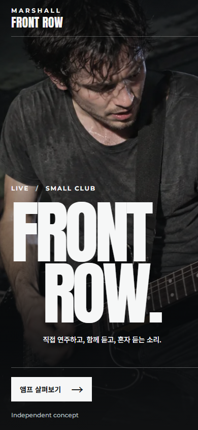

# Marshall Front Row

Marshall의 무대 에너지를 재해석한 **비공식** 포트폴리오 디자인 시안입니다. Marshall Group이 운영하거나 제휴한 사이트가 아닙니다.

**사이트** https://lyh6763.github.io/marshall/ · **제작 이야기** [Case Study](https://lyh6763.github.io/marshall/case-study.html)



## 어떤 사이트인가요

작은 클럽 공연을 맨 앞줄에서 보는 첫 화면으로 시작해, 앰프·스피커·헤드폰 세 제품으로 바로 이어집니다. 가격·재고·구매 기능은 없습니다.

| 영역 | 내용 |
| --- | --- |
| 첫 화면 | 관객 시점의 공연 장면, 큰 타이포, 제품 카테고리 메뉴 |
| The Gear | DSL40 Combo(기타 앰프)를 크게, Acton IV(홈 스피커)와 Monitor III A.N.C.(헤드폰)를 나란히 소개 |
| 제품 상세 3종 | 사용 장면, 핵심 사양, 맞지 않는 상황("다시 생각할 때"), 공식 출처와 확인일 |
| Stories | 앰프 제작·작은 공연장·Amplify 공식 자료로 연결 |
| Case Study | 디자인 결정, 이미지·출처 정책, 검증 결과 |

<p>
  
  
</p>
<p>
  
</p>

## 디자인 결정

- **무대 다음에, 바로 제품.** 선택 카드·추천 질문·비교표처럼 콘셉트 해석을 요구하는 단계를 덜어내고, 첫 화면에서 제품으로 바로 이어지게 했습니다.
- **첫 화면의 각 줄이 다른 정보를.** 라벨은 장면(LIVE / SMALL CLUB), 제목은 콘셉트(FRONT ROW.), 설명은 세 제품의 쓰임새(직접 연주하고, 함께 듣고, 혼자 듣는 소리)를 전합니다.
- **중성색과 백색 조명.** 이전 시안의 붉은 조명·크림색 반복에서 벗어나 검정·회색·흰색으로 정리했습니다.
- **직접 만든 이미지만.** 히어로는 생성한 가상 공연 장면, 제품은 형태를 단순화한 무로고 SVG 일러스트, 로고는 사이트 글꼴로 조판한 텍스트입니다. Marshall 공식 사진과 로고는 쓰지 않습니다.

## 접근성

- 본문 바로가기, 키보드로 쓸 수 있는 모바일 메뉴(포커스 가두기, Escape로 닫기, 포커스 복귀)
- JavaScript가 꺼져 있어도 메뉴와 모든 링크 사용 가능
- 모션 감소 설정에서는 히어로 움직임 제거
- 본문·링크·메뉴 14px 이상, 라벨 12~13px 이상
- 외부 링크는 ↗로 표시하고, 장식용 화살표는 화면 낭독기에서 숨김
- 작은 휴대폰(320×568)에서도 첫 화면에 CTA 버튼 노출

## 기술

HTML · CSS · Vanilla JS. 빌드 도구 없이 정적 파일로 배포합니다.

```text
index.html            홈
products/             제품 상세 3종 (amplifiers, speakers, headphones)
case-study.html       제작 이야기
css/                  reset(토큰) · marshall(헤더·메뉴·푸터) · front-row(홈·로고) · stage-header(첫 화면) · detail(상세)
js/                   navigation(모바일 메뉴) · stage-header(고정 헤더·히어로 모션) · footer(푸터 접기)
img/                  히어로 이미지, 제품 일러스트, 파비콘
scripts/validate.mjs  npm test 검사 스크립트
docs/                 기획·출처·작업 기록, README 스크린샷
```

반응형 WebP, 화면 크기별 히어로 preload, 제품 카드 컨테이너 쿼리를 사용합니다.

## 실행과 검사

로컬 서버:

```bash
npx serve -l 4321 .
```

검사:

```bash
npm test
```

`npm test`는 다음을 확인합니다.

- 페이지마다 `h1`과 `main`이 하나인지, 태그 짝이 맞는지, `id`가 중복되지 않는지
- 빈 `#` 링크나 `javascript:` 링크가 없는지
- 로컬 링크·앵커·이미지·`srcset` 경로가 실제로 있는지
- 모든 `img`에 `alt`, `width`, `height`가 있는지
- CSS 중괄호 짝과 JS 문법
- 어떤 페이지나 CSS에서도 쓰지 않는 css·js·img 파일이 없는지

## 확인 범위와 한계

- `npm test`, 320~1920px 화면, 모바일 키보드 메뉴, 모션 감소, JavaScript 비활성 경로를 확인했습니다.
- 실제 사용자 테스트와 배포 후 Core Web Vitals 실측은 하지 않았습니다.
- 제품 사양은 각 상세 페이지에 공식 출처와 확인일(2026-09-29)을 함께 적었습니다. 이후 바뀌었을 수 있습니다.

## 문서

- [기획서](PROJECT_BRIEF.md)
- [포트폴리오 요약](docs/PORTFOLIO.md)
- [콘텐츠 출처](docs/CONTENT_SOURCES.md)
- [제작 기록](docs/REFRESH_STUDY.md) · [헤더 시안 기록](docs/HEADER_STUDY.md)
- [변경 기록](docs/CHANGELOG.md) · [작업 로그](docs/WORKLOG.md)

## 고지

Independent portfolio concept. Not operated by or affiliated with Marshall Group. Marshall is a trademark of its respective owner. 제품 이름과 사양은 설명 목적으로만 인용했습니다.
